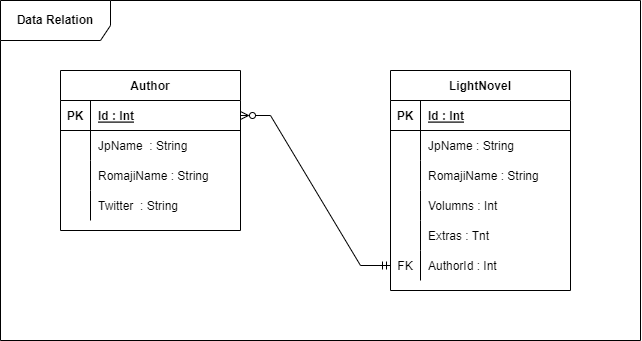
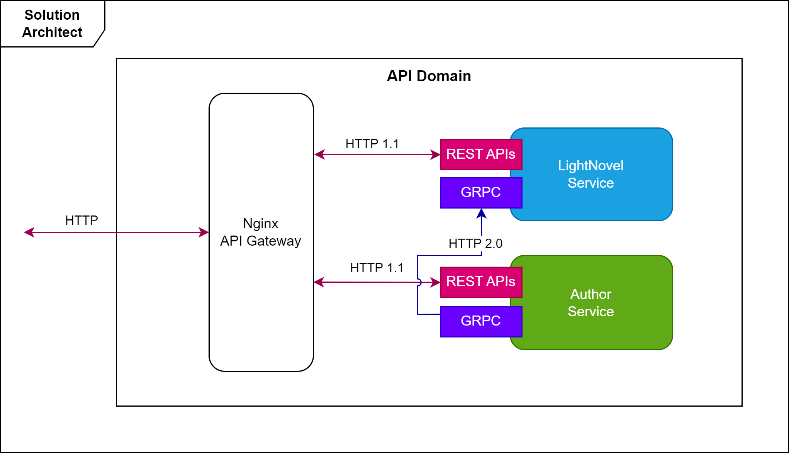

# Mastering Docker 

## Getting Started

Make sure you have [installed](https://docs.docker.com/docker-for-windows/install/) and configured docker in your environment. After that, you can run the below commands from the **/src/** directory and get started with the application immediately.

```powershell
docker-compose build
docker-compose up -d
```

You should be able to browse the API gateway of the application by using the below URLs:

```
API Gateway : http://localhost:8080/
```

## Architecture Overview

The architecture proposes a microservice oriented architecture implementation with multiple autonomous microservices (each one owning its own data/db) and implementing different approaches within each microservice using HTTP as the communication protocol between the services.




## Docker In-depth 

**Step 1: Build application images**

1. Author API

Create Dockerfile

```bash
cd src/AuthorService
touch Dockerfile
```

Write this content to the file

```dockerfile
# Base image for aspnet runtime
FROM mcr.microsoft.com/dotnet/aspnet:6.0-focal AS base

# Choose default work direction
WORKDIR /app

# Port for REST API
EXPOSE 5171

# Port for gPRC
EXPOSE 50051

# Creates a non-root user with an explicit UID and adds permission to access the /app folder
# For more info, please refer to https://aka.ms/vscode-docker-dotnet-configure-containers
RUN adduser -u 5678 --disabled-password --gecos "" appuser && chown -R appuser /app
USER appuser

# Stage: build

# Base image for aspnet sdk
FROM mcr.microsoft.com/dotnet/sdk:6.0-focal AS build

# Work direction on host machine
WORKDIR /src

# Copy then restore project dependencies
COPY ["AuthorService.csproj", "./"]
RUN dotnet restore "AuthorService.csproj"

# Copy remain items
COPY . .

# Build the API
WORKDIR "/src/."
RUN dotnet build "AuthorService.csproj" -c Release -o /app/build

# Stage: Publish

# Base image for aspnet sdk
FROM build AS publish

# Publish the API
RUN dotnet publish "AuthorService.csproj" -c Release -o /app/publish /p:UseAppHost=false

# Stage: Final

# Base image for aspnet runtime
FROM base AS final

# Copy the published API then run the API
WORKDIR /app
COPY --from=publish /app/publish .
ENTRYPOINT ["dotnet", "AuthorService.dll"]
```

Build the image

```bash
docker build -t author-api .
```

2. Novel API

Create Dockerfile

```bash
cd src/NovelService
touch Dockerfile
```

Write this content to the file

```dockerfile
# Base image for aspnet runtime
FROM mcr.microsoft.com/dotnet/aspnet:6.0-focal AS base

# Choose default work direction
WORKDIR /app

# Port for REST API
EXPOSE 5093

# Creates a non-root user with an explicit UID and adds permission to access the /app folder
# For more info, please refer to https://aka.ms/vscode-docker-dotnet-configure-containers
RUN adduser -u 5678 --disabled-password --gecos "" appuser && chown -R appuser /app
USER appuser

# Stage: build

# Base image for aspnet sdk
FROM mcr.microsoft.com/dotnet/sdk:6.0-focal AS build

# Work direction on host machine
WORKDIR /src

# Copy then restore project dependencies
COPY ["LightNovelService.csproj", "./"]
RUN dotnet restore "LightNovelService.csproj"

# Copy remain items
COPY . .

# Build the API
WORKDIR "/src/."
RUN dotnet build "LightNovelService.csproj" -c Release -o /app/build

# Stage: Publish

# Base image for aspnet sdk
FROM build AS publish

# Publish the API
RUN dotnet publish "LightNovelService.csproj" -c Release -o /app/publish /p:UseAppHost=false

# Stage: Final

# Base image for aspnet runtime
FROM base AS final

# Copy the published API then run the API
WORKDIR /app
COPY --from=publish /app/publish .
ENTRYPOINT ["dotnet", "LightNovelService.dll"]
```

Build the image

```bash
docker build -t novel-api .
```

3. API Gateway

Create Dockerfile

```bash
cd src/ApiGw
touch Dockerfile
```

Write this content to the file

```dockerfile
# Base image for nginx
FROM nginx:alpine

# Port for the API Gateway
EXPOSE 80

# Override the configuration file
COPY ./api_gateway.conf /etc/nginx/conf.d/default.conf
```

Build the image

```bash
docker build -t api-gw .
```

**Step 2: Create compose file**

The docker-compose is used to reduce the time and effort for configuring the volume and the network of Docker

1. Create docker-compose file

```bash
cd src
touch docker-compose.yml
```

2. Create network and volume

```
networks:
  mastering-docker-backend-network:
    driver: bridge

volumes:
  sqlserverdata:
```

3. Declare using services

```
services:

  # API Gateway service
  api-gw:
    build:
      context: ApiGw
      dockerfile: ./Dockerfile
    ports:
      - 8080:80
    networks:
      - mastering-docker-backend-network
    depends_on:
      - author-api
      - novel-api

  # Author API service
  author-api:
    build:
      context: AuthorService/
      dockerfile: ./Dockerfile
    networks:
      - mastering-docker-backend-network
  
  # Novel API service
  novel-api:
    build:
      context: NovelService/
      dockerfile: ./Dockerfile
    depends_on:
      - author-api
    networks:
      - mastering-docker-backend-network
```

**Step 3: Optimize Dockerfile**

- [x] Optimize 1: Don't install unnecessary dependencies

    Using a --no-install-recommends when apt-get installing packages. This will result in a smaller image size.

```dockerfile
RUN apt-get update && apt-get install -y --no-install-recommends
```

- [x] Optimize 2: Remove apt library cache

    Use of apt-get update should be paired with rm -rf /var/lib/apt/lists/* in the same layer.

```dockerfile
RUN apt-get update && rm -rf /var/lib/apt/lists/*
```

- [x] Optimize 3: Use .dockerignore file

    Use docker ignore file on the root of context directory to ignore stuff we don't want to keep when building docker image.

```
**/.classpath
**/.dockerignore
**/.env
**/.git
**/.gitignore
**/.project
**/.settings
**/.toolstarget
**/.vs
**/.vscode
**/*.*proj.user
**/*.dbmdl
**/*.jfm
**/bin
**/charts
**/docker-compose*
**/compose*
**/Dockerfile*
**/node_modules
**/npm-debug.log
**/obj
**/secrets.dev.yaml
**/values.dev.yaml
README.md
```

- [x] Optimize 4: Choose correct base image

    - Don't use latest tag because it's change frequently.
    - Prefer minimal version (use image with _-alpine_ suffix).
    - Use official image.

- [x] Optimize 5: Order matters for caching

    Analyse the source code, move some thing doesn't change frequently to top layers.

    

- [x] Optimize 6: Use multi-stage if needed

    If you are using one container for multi purpose, please consider to break it smaller into multi-stage.

**Step 4: Final check**

Make request to API gateway (http://localhost:8080) to make sure the application is working

```
curl http://localhost:8080/api/author
```
